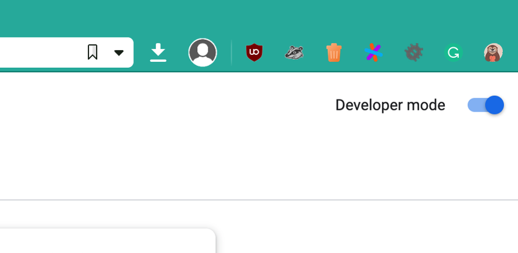
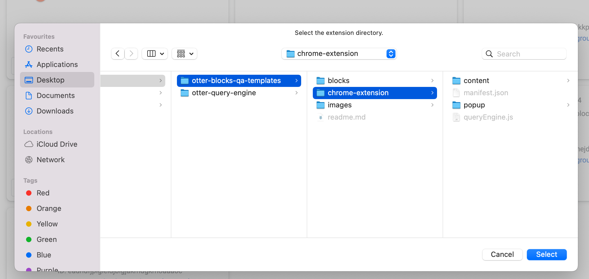

# Otter Tool Testing
> This tool insert blocks exports into the page.

## Getting started

Use together with [Query Engine](https://github.com/Codeinwp/otter-query-engine)

You can use the chrome browser extension to add the script in every page. You can add the folder `chrome-extension` via [Developer Mode](https://developer.chrome.com/docs/extensions/mv3/faq/#:~:text=You%20can%20start%20by%20turning,a%20packaged%20extension,%20and%20more.)

## Concepts

Every folder in the `blocks` represent a source/database from which we can get the exported blocks. Every folder that is used a source/database must have `index.json` in which we list the available files and their features. See `blocks/index.json` as example.

The folders `sites` will contain exported sites, which will help to test mode advance blocks like Posts, Comparison Review.

## Chrome Extension Install

#### Steps

1. Enable developer mode in **Tools > Extensions**. The toggle is in the top-right corner.  

2. Load the extensions via **Load unpacked**  

3. Select the **chrome-extension** folder  

